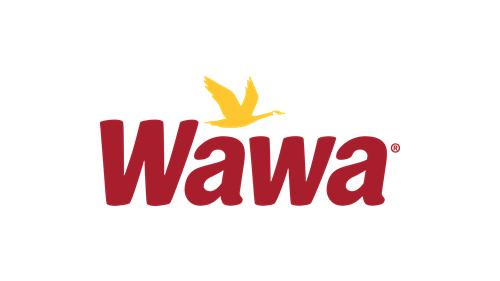

[](https://google.com/) [](https://google.com/) [](https://codefresh.io/steps/)

# Name of the Component

## Table of Contents

1. [Introduction](#1-Introduction)
2. [Prerequisites](#2-Prerequisites)
3. [Environment Variables](#3-environment-variables)
4. [Consumed Services](#4-consumed-services)
5. [Event Produced & Consumed](#5-events-produced-and-events-consumed)
6. [Logging](#6-logging)
7. [Health Checks](#7-health-checks)
8. [Build & Deployment](#8-build-and-deployment)
9. [Testing Instructions](#9-testing-instructions)

## 1. Introduction

Provide Description of Component

### See Also
* [Design Reference](docs/DESIGN.md)
* [Support Reference](docs/SUPPORT.md)

### Supporting Team(s)
* <ins>Engineering Team 3</ins> is the owner of Creating the Standard for README.md.

## 2. Prerequisites
### <ins>Tools/Software</ins>

* [Java Build System](https://wawaappdev.atlassian.net/wiki/spaces/KM/pages/328830959/Java)
* [Approved IDE](https://wawaappdev.atlassian.net/wiki/spaces/KM/pages/329352164/IDE)
* [Local Integrated Environment](https://wawaappdev.atlassian.net/wiki/spaces/KM/pages/447155015/Local+Docker+Desktop+Kubernetes+Istio+Kafka+Mongo+Development)
    
### <ins>Wawa Build Time Dependencies</ins>

| Project Name         | Version       |  Project URL  |   
|:---------------------|:--------------|:--------------------------------------------------------|      
|  Starter XX          |    XX+        | [core-apaas-api-starter](https://github.com/wawa/core-apaas-app-starters/tree/master/core-apaas-api-starter) |
|  Starter XX          |    XX+        | [core-apaas-json-starter](https://github.com/wawa/core-apaas-app-starters/tree/master/core-apaas-json-starter) |

### <ins>Infrastructure</ins>

|Software              | Version       | Comment(s)  |   
|:---------------------|:--------------|:--------------------------------------------------------|      
|  Database XX         |    XX+        |    Database server |
|  Message Bus XX      |    XX+        |    Message bus for inter service communication |

## 3. Environment Variables

|Environment Variable Name | Type (Env or Secret)  |  Scope (Build or Runtime)    | Responsible Party for value  | Purpose | Comment(s)  |   
|:-------------------------|:----------------------|:-----------------------------|:-----------------------------|:--------|:------------|      
|  SERVICE_BASE_URL    |    Env        |    Build & Runtime       |  Integration Platform    |           |  Scope of this variable changes at run time|
 |  BUILD_NUMBER           |    Env        |    Build & Runtime       |  Integration Platform    |           |  It is pr_pull_number |         |  BUILD_HASH               |    Env        |    Build & Runtime       |  Integration Platform    |           |  It is github hash    |  
  |  APP_VERSION           |    Env        |    Build & Runtime       |  Application Developer   |           |  The app_version comes from              the helm chart.|
 |   GITHUB_TOKEN          |    Env        |    Build             |  Integration Platform    |This variable allows downloading npm packages published to the GitHub NPM Registry.   |  To be renamed to GIT_PACKAGE_MANAGER_TOKEN   |
|ENABLE_BUILD_DETAILS|Env| Build & Runtime|Application Developer|Control visibility of build and version number in UI application expected value:- true : to show details false : to hide details        |  Yet to be created. It will come from helm chart.|

## 4. Consumed Services
| Service             | Discovery Address       |   
|:--------------------|:------------------------|   
|  Service XX         |  \<Discovery Address>  |
|  Service XX         |  \<Discovery Address>  |

*Discovery address is the name in the Istio service mesh that is used to access a downstream service*

## 5. Events Produced And Events Consumed
| Event               |  Event Schema          |  Description           |
|:--------------------|------------------------|------------------------|
|  Service XX         | [SchemaA](schemas/schema.avro)  | BLAH  |
|  Service XX         | [SchemaA](schemas/schema.avro)  | BLAH  |

## 6. Logging

 This section should have critical logging messages that can be used to understand the health of this component or aid in the debugging of the component

*[Logging Standard](https://wawaappdev.atlassian.net/wiki/spaces/ENTERPRISE/pages/337412190/ST9.1-+Logging+Standard)*

## 7. Health Checks
| Endpoint             | Path               |   Content     |
|:--------------------|:--------------------|---------------|   
|  Endpoint Path      |  /healthz           |   OK          |

*Endpoints and the decoder for the current state of the service and any dependent components*

## 8. Build And Deployment
### Compilation
```bash
cd myapp
mvn clean package
```

### Run As Application
```bash
java -jar ./myapp.jar
```

### Build Container
```bash
docker build .
```

### Run In Local Kubernetes
```bash
export $appname=myapp
helm upgrade $appname . --install --recreate-pods --namespace $namespace --version $appversion --values $values
```

## 9. Testing Instructions 
### Unit test cases
There are multiple unit test cases written to cover the different components of the application. However there is a global application test suite file _**UnitTests.java**_     that combines all the test cases in a logical manner to create a complete suite. It can be run from command prompt using the following command -

```
mvn clean test
```

