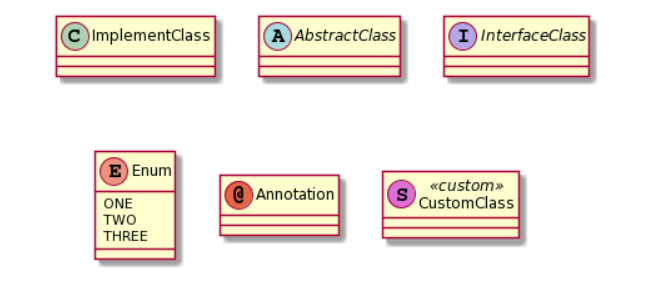
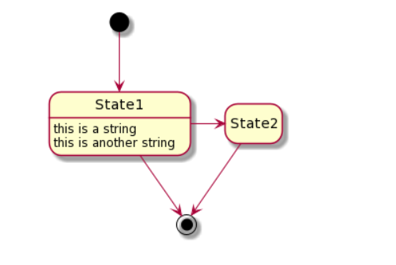

# Component - Detailed Design

## Table of Contents
1. [UML Diagrams](#1-uml-diagrams)
2. [Dependent Downstream Services](#2-dependent-downstream-services)
3. [Understanding the Code](#3-understanding-the-code)
4. [References](#4-references)

## 1. UML Diagrams
### Entity Relationship Diagram

### Entity State Machine Diagram

## 2. Dependent Downstream Services
Describe the dependent services in your application.

## 3. Understanding the Code
        

           Details about Application Configuration, Application Profiling and Code walk through  
         
         
## 4. References
| Link | Description | 
| :---- | :----------- |
| [ABB-Business Service](https://wawaappdev.atlassian.net/wiki/spaces/ENTERPRISE/pages/586843021/ABB+-+Business+Service) |  Confluence page|
